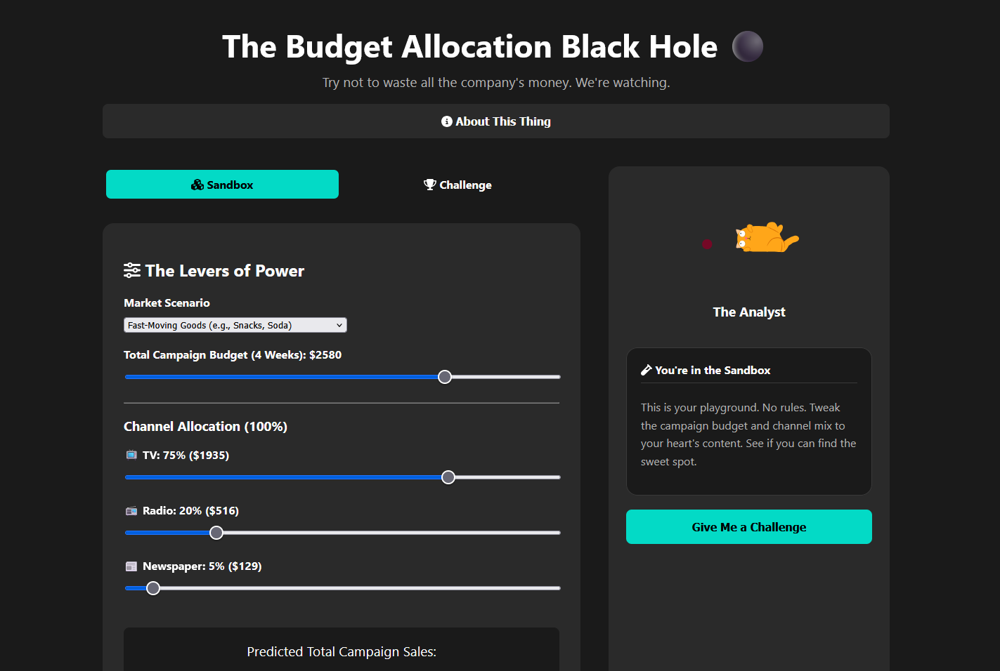

# The Budget Allocation Black Hole ⚫

Welcome to "The Budget Allocation Black Hole," a Marketing Mix Modeling (MMM) simulator designed for the aspiring strategist. This interactive web application challenges you to find the optimal marketing budget allocation to maximize sales, all while an AI analyst provides witty and insightful feedback on your performance.



## 🚀 Features

* **Dual Modes:**
    * **Sandbox Mode:** A consequence-free playground to explore how changing budgets and channel allocations affect predicted sales.
    * **Challenge Mode:** Receive a unique business scenario, budget, and sales goal from the AI Analyst.
* **Intelligent AI Opponent:** Powered by the Gemini API, the analyst generates creative challenges and provides data-driven feedback on your strategy, understanding the nuances of the underlying model.
* **Advanced MMM Engine:** The simulation isn't just linear. It's powered by a sophisticated model that accounts for:
    * **Adstock (Decay):** The lingering effect of advertising over time.
    * **Saturation (Diminishing Returns):** The more you spend on a channel, the less effective each additional dollar becomes.
* **Switchable Market Scenarios:** Choose between different market types (e.g., "Fast-Moving Goods" vs. "High-Consideration Goods") which loads a different underlying model with unique adstock and saturation parameters, reflecting real-world market dynamics.
* **Dynamic UI:** The interface is built with modern HTML, CSS, and JavaScript, featuring animated Lottie files for the AI analyst's persona.

## 🛠️ Tech Stack

* **Frontend:** HTML5, CSS3, Vanilla JavaScript
* **Backend:** Python with Flask
* **Machine Learning:** Scikit-learn
* **AI:** Google's Gemini API

## ⚙️ Running the Project Locally

### Prerequisites

* Python 3.7+
* A Google Gemini API Key

### Setup

1.  **Clone the repository:**
    ```bash
    git clone <your-repo-url>
    cd mmm_simulator
    ```
2.  **Backend Setup:**
    ```bash
    cd backend
    python -m venv venv
    source venv/bin/activate  # On Windows, use `venv\Scripts\activate`
    pip install -r requirements.txt
    export GEMINI_API_KEY="YOUR_API_KEY" # On Windows, use `set GEMINI_API_KEY="YOUR_API_KEY"`
    ```
3.  **Train the Models:**
    Run the training scripts to generate the `.pkl` files:
    ```bash
    python train_fast_decay.py
    python train_slow_decay.py
    ```
4.  **Start the Backend Server:**
    ```bash
    flask run
    ```
    The backend will be running at `http://127.0.0.1:5000`.

5.  **Frontend Setup:**
    Navigate to the `frontend` folder and open the `index.html` file in your web browser.
